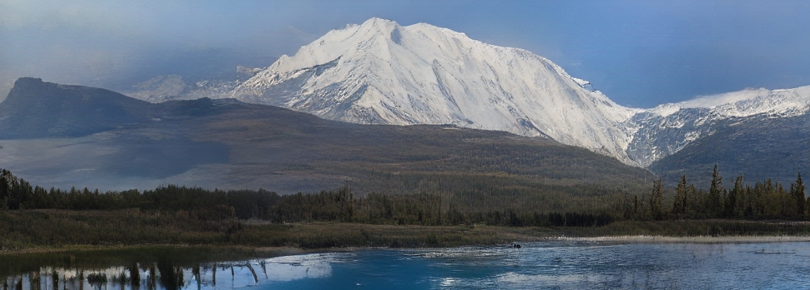

# Taming Transformers for High-Resolution Image Synthesis


Code for

[**Taming Transformers for High-Resolution Image Synthesis**](https://compvis.github.io/taming-transformers/)<br/>
[Patrick Esser](https://github.com/pesser)\*,
[Robin Rombach](https://github.com/rromb)\*,
[Björn Ommer](https://hci.iwr.uni-heidelberg.de/Staff/bommer)<br/>
\* equal contribution

**tl;dr** We combine the efficiancy of convolutional approaches with the expressivity of transformers by introducing a convolutional VQGAN, which learns a codebook of context-rich visual parts, whose composition is modeled with an autoregressive transformer.


[arXiv](https://arxiv.org/abs/2012.09841) | [BibTeX](#bibtex) | [Project Page](https://compvis.github.io/taming-transformers/)

## Requirements
A suitable [conda](https://conda.io/) environment named `taming` can be created
and activated with:

```
conda env create -f environment.yaml
conda activate taming
```

## Data Preparation

### CelebA-HQ
Create a symlink `data/celebahq` pointing to a folder containing the `.npy`
files of CelebA-HQ (instructions to obtain them can be found in the [PGGAN
repository](https://github.com/tkarras/progressive_growing_of_gans)).

### FFHQ
Create a symlink `data/ffhq` pointing to the `images1024x1024` folder obtained
from the [FFHQ repository](https://github.com/NVlabs/ffhq-dataset).

## Running pretrained models

### S-FLCKR


Download the [2020-11-09T13-31-51_sflckr](https://heibox.uni-heidelberg.de/d/73487ab6e5314cb5adba/) folder and place it into `logs`. 
Then, run
```
streamlit run scripts/sample_conditional.py -- -r logs/2020-11-09T13-31-51_sflckr/
```

### FacesHQ
Download [2020-11-09T13-31-51_sflckr](TODO) and place it into `logs`. Run
```
streamlit run scripts/sample_conditional.py -- -r logs/2020-11-13T21-41-45_faceshq_transformer/
```

## Training models

### FacesHQ

Train a VQGAN with
```
python main.py --base configs/faceshq_vqgan.yaml -t True --gpus 0,
```

Then, adjust the checkpoint path of the config key
`model.params.first_stage_config.params.ckpt_path` in
`configs/faceshq_transformer.yaml` (or download
[2020-11-09T13-33-36_faceshq_vqgan](TODO) and place into `logs`, which
corresponds to the preconfigured checkpoint path), then run
```
python main.py --base configs/faceshq_transformer.yaml -t True --gpus 0,
```

## Shout-outs
Thanks to everyone who makes their code and models available. In particular,

- The architecture of our VQGAN is inspired by [Denoising Diffusion Probabilistic Models](https://github.com/hojonathanho/diffusion)
- The very hackable transformer implementation [minGPT](https://github.com/karpathy/minGPT)
- The good ol' [PatchGAN](https://github.com/junyanz/pytorch-CycleGAN-and-pix2pix) and [Learned Perceptual Similarity (LPIPS)](https://github.com/richzhang/PerceptualSimilarity)

## BibTeX

```
@misc{esser2020taming,
      title={Taming Transformers for High-Resolution Image Synthesis}, 
      author={Patrick Esser and Robin Rombach and Björn Ommer},
      year={2020},
      eprint={2012.09841},
      archivePrefix={arXiv},
      primaryClass={cs.CV}
}
```
